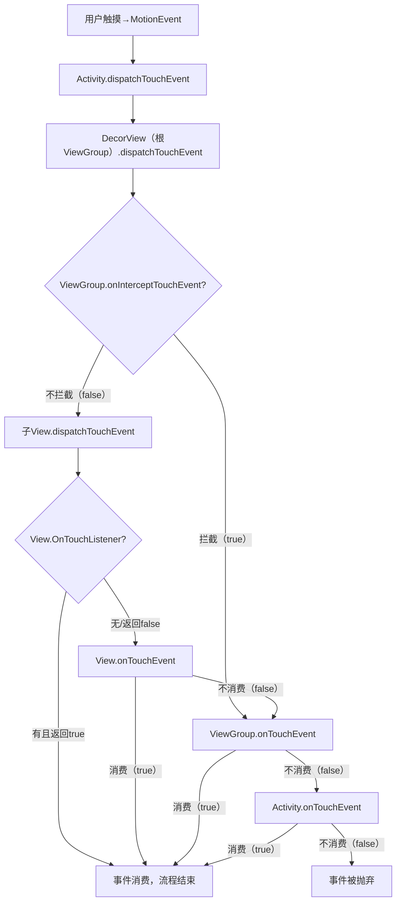

# Android 事件分发机制详解

### 一、Android事件分发机制核心本质

Android事件分发是**触摸事件（`MotionEvent`）从屏幕触发后，在「Activity → ViewGroup → View」三级控件间“自上而下分发、可拦截、未消费则自下而上回传”的完整流程**，核心解决“哪个控件应该响应并处理用户的触摸操作”问题。

#### 1. 核心基础

- **事件载体**：`MotionEvent`，核心类型包括`ACTION_DOWN`（按下，事件序列起点）、`ACTION_MOVE`（移动）、`ACTION_UP`（抬起，事件序列终点）、`ACTION_CANCEL`（取消，如滑动出控件范围）；

- **核心三个方法**（所有控件的事件分发都围绕这三个方法展开）：

| 方法名                     | 所属控件                    | 核心作用                     | 返回值含义                         |
|-------------------------|-------------------------|--------------------------|-------------------------------|
| `dispatchTouchEvent`    | Activity/ViewGroup/View | 事件分发入口，决定事件“往下传递”或“自己处理” | `true`：事件已处理；`false`：未处理，向上回传 |
| `onInterceptTouchEvent` | ViewGroup（独有）           | 拦截事件，决定是否阻止事件传递给子View    | `true`：拦截；`false`：不拦截（默认）     |
| `onTouchEvent`          | Activity/ViewGroup/View | 事件消费逻辑（处理点击、滑动等）         | `true`：消费事件；`false`：不消费，向上回传  |
#### 2. 核心规则

- 一个**事件序列**（从`DOWN`到`UP`）的归属由`ACTION_DOWN`决定：只有`DOWN`被某个控件消费，后续的`MOVE/UP`才会持续传给该控件；

- 优先级：`OnTouchListener.onTouch` > `onTouchEvent` > `OnClickListener.onClick`（`OnTouch`返回`true`会直接阻断后续消费）；

- 回传规则：事件未被消费时，会从当前控件向上回传给父控件，直到Activity，若最终无控件消费则被系统抛弃。

---

### 二、完整事件分发流程（结合代码+逻辑）

#### 1. 第一步：Activity层分发（事件入口）

用户触摸屏幕后，事件首先传递到`Activity`的`dispatchTouchEvent`，核心逻辑如下：

```Kotlin
// Activity.dispatchTouchEvent 源码简化版（Kotlin）
override fun dispatchTouchEvent(ev: MotionEvent): Boolean {
    // 1. 委托给Window（PhoneWindow）的DecorView（根ViewGroup）分发
    if (window.superDispatchTouchEvent(ev)) {
        return true // DecorView分发成功（事件被消费），流程结束
    }
    // 2. 若DecorView未消费，Activity自己处理事件
    return onTouchEvent(ev)
}

// Activity.onTouchEvent 默认实现
override fun onTouchEvent(ev: MotionEvent): Boolean {
    // 默认返回false（Activity不消费事件），最终事件被抛弃
    return false
}
```

**关键**：Activity本身不直接处理事件，仅作为入口，优先让根布局（DecorView）分发。

#### 2. 第二步：ViewGroup层分发（核心拦截层）

ViewGroup是中间层，既要决定是否拦截事件，也要负责将事件分发给子View，以`LinearLayout`为例，核心逻辑：

```Kotlin
// ViewGroup.dispatchTouchEvent 源码简化版
override fun dispatchTouchEvent(ev: MotionEvent): Boolean {
    var isIntercept = false
    val action = ev.actionMasked

    // 仅ACTION_DOWN/有已消费的子View时，才判断是否拦截
    if (action == MotionEvent.ACTION_DOWN || mFirstTouchTarget != null) {
        isIntercept = onInterceptTouchEvent(ev) // 调用拦截方法
    }

    // 场景1：不拦截事件 → 分发给子View
    if (!isIntercept) {
        // 遍历子View（从上层到下层，如FrameLayout后添加的View优先）
        for (child in children.reversed()) {
            // 检查子View是否在触摸区域内
            if (isTouchInView(child, ev) && child.dispatchTouchEvent(ev)) {
                mFirstTouchTarget = child // 记录消费事件的子View
                return true // 子View消费，流程结束
            }
        }
    }

    // 场景2：拦截事件 / 无子View消费 → 自己处理（调用onTouchEvent）
    return onTouchEvent(ev)
}

// ViewGroup.onInterceptTouchEvent 默认实现
override fun onInterceptTouchEvent(ev: MotionEvent): Boolean {
    return false // 默认不拦截，事件继续向下传递
}
```

**关键细节**：

- 拦截仅对`ACTION_DOWN`生效：若`ACTION_DOWN`时返回`true`拦截，后续`MOVE/UP`会直接交给该ViewGroup处理，不再调用`onInterceptTouchEvent`；

- 子View遍历顺序：ViewGroup会优先分发给“视觉上在顶层”的子View（如RelativeLayout中覆盖的View）。

#### 3. 第三步：View层分发（最终消费层）

View无自控件，因此`dispatchTouchEvent`仅负责“是否自己消费事件”，核心逻辑：

```Kotlin
// View.dispatchTouchEvent 源码简化版
override fun dispatchTouchEvent(ev: MotionEvent): Boolean {
    // 优先级1：OnTouchListener（若设置且返回true，直接消费）
    if (mOnTouchListener != null && isEnabled && mOnTouchListener.onTouch(this, ev)) {
        return true
    }
    // 优先级2：自身onTouchEvent（处理点击、长按等）
    return onTouchEvent(ev)
}

// View.onTouchEvent 核心逻辑
override fun onTouchEvent(ev: MotionEvent): Boolean {
    val clickable = isClickable || isLongClickable // 可点击控件（如Button）为true
    if (!clickable) return false // 不可点击的View（如默认TextView）直接返回false

    when (ev.action) {
        MotionEvent.ACTION_UP -> {
            performClick() // 触发OnClickListener.onClick
            // 处理长按、双击等逻辑
        }
        MotionEvent.ACTION_DOWN -> {
            // 记录按下状态，准备处理长按
        }
    }
    return true // 可点击View默认消费事件
}
```

**关键**：`OnTouchListener`优先级高于`OnClickListener`，若`OnTouch`返回`true`，`onClick`不会触发（因为`onTouchEvent`未被执行）。

#### 4. 事件回传流程（未消费时）

若所有子View都返回`false`（不消费），事件会从底层向上回传：

```Plain Text
View（不消费） → 父ViewGroup.onTouchEvent → 若ViewGroup也不消费 → Activity.onTouchEvent → 若Activity也不消费 → 事件被抛弃
```

---

### 三、实际场景案例（理解核心逻辑）

#### 场景1：Button点击（正常消费流程）

**结构**：Activity → LinearLayout → Button

**事件走向**：

1. Activity.dispatchTouchEvent → 委托给LinearLayout；

2. LinearLayout.onInterceptTouchEvent返回false（不拦截），分发给Button；

3. Button.dispatchTouchEvent → 无OnTouchListener，调用onTouchEvent；

4. Button是可点击控件，onTouchEvent返回true（消费事件）；

5. 整个流程结束，LinearLayout和Activity不再处理。

**特殊情况**：若给Button设置`setOnTouchListener`且返回`true`，则`onClick`不会触发（`onTouchEvent`未执行）。

#### 场景2：ScrollView嵌套ListView（拦截与反拦截）

**问题**：ScrollView（ViewGroup）和ListView（ViewGroup）都要处理滑动，默认ScrollView会拦截横向/纵向滑动，导致ListView无法滑动。

**解决方案**：ListView通过`requestDisallowInterceptTouchEvent`禁止父View（ScrollView）拦截事件：

```Kotlin
// ListView的onTouchEvent中添加
override fun onTouchEvent(ev: MotionEvent): Boolean {
    when (ev.action) {
        MotionEvent.ACTION_DOWN -> {
            // 禁止父View（ScrollView）拦截事件
            parent.requestDisallowInterceptTouchEvent(true)
        }
        MotionEvent.ACTION_UP, MotionEvent.ACTION_CANCEL -> {
            // 恢复父View的拦截能力
            parent.requestDisallowInterceptTouchEvent(false)
        }
    }
    return super.onTouchEvent(ev)
}
```

**原理**：`requestDisallowInterceptTouchEvent(true)`会让ScrollView的`onInterceptTouchEvent`失效（仅对`DOWN`之后的事件生效），确保ListView能接收完整的滑动事件序列。

#### 场景3：自定义ViewGroup拦截侧滑事件（如侧滑返回）

**需求**：自定义一个`SwipeBackLayout`（ViewGroup），检测到用户从左侧滑动时，拦截事件实现侧滑返回，否则分发给子View。

```Kotlin
class SwipeBackLayout(context: Context) : LinearLayout(context) {
    private var startX = 0f

    override fun onInterceptTouchEvent(ev: MotionEvent): Boolean {
        when (ev.action) {
            MotionEvent.ACTION_DOWN -> {
                startX = ev.x // 记录按下的X坐标
            }
            MotionEvent.ACTION_MOVE -> {
                val dx = ev.x - startX
                // 从左侧滑动（X偏移>100px），拦截事件
                if (dx > 100 && startX < 50) {
                    return true
                }
            }
        }
        return super.onInterceptTouchEvent(ev)
    }

    override fun onTouchEvent(ev: MotionEvent): Boolean {
        // 处理侧滑返回逻辑（如更新布局偏移、触发Activity.finish()）
        return true // 消费拦截的事件
    }
}
```

**逻辑**：`onInterceptTouchEvent`在`MOVE`时判断滑动方向，返回`true`拦截事件，后续`MOVE/UP`会直接交给`SwipeBackLayout`的`onTouchEvent`处理，实现侧滑返回。

#### 场景4：View不消费事件（如默认TextView）

**结构**：Activity → LinearLayout → TextView（默认不可点击）

**事件走向**：

1. TextView.onTouchEvent返回false（不消费）；

2. 事件回传给LinearLayout.onTouchEvent（默认返回false）；

3. 事件回传给Activity.onTouchEvent（默认返回false）；

4. 最终事件被抛弃，无任何控件响应。

**改造**：若给TextView设置`setClickable(true)`，则TextView.onTouchEvent返回true，事件被消费。

---

### 四、核心流程可视化



---

### 总结

1. **核心流程**：事件自上而下（Activity→ViewGroup→View）分发，ViewGroup可拦截，未消费则自下而上回传，`ACTION_DOWN`决定事件序列归属；

2. **核心方法**：`dispatchTouchEvent`（分发）、`onInterceptTouchEvent`（ViewGroup拦截）、`onTouchEvent`（消费），返回值决定事件走向；

3. **实际应用**：侧滑返回（拦截事件）、嵌套滑动（反拦截）、自定义点击逻辑（消费事件）等场景，本质都是通过重写三个方法控制事件流向。
> （注：文档部分内容可能由 AI 生成）